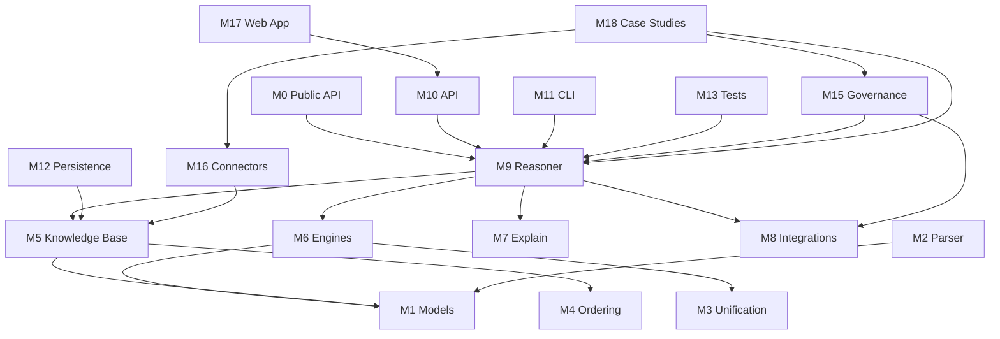

# AxiomAI — Project Module Breakdown

**Version:** 1.0  
**Date:** 2026-06-17  
**Package:** `axiomai` v0.2.0  
**Companion doc:** [IMPLEMENTATION-TRACKER.md](./IMPLEMENTATION-TRACKER.md)

---

## 1. Executive Summary

AxiomAI is a **deterministic reasoning engine** positioned as the trust layer for AI agents and regulated enterprise workflows. The project spans four layers:

| Layer | Purpose | Status |
|-------|---------|--------|
| **L0 — Core Engine** | Logic, inference, proofs, KB | ~90% implemented (alpha, P0 verified) |
| **L1 — Platform** | CLI, REST API, persistence, tests | ~65% implemented (CLI/API done; tests/CI pending) |
| **L2 — Application Framework** | Agent governance, connectors, UI shell | Not started |
| **L3 — Vertical Case Studies** | 18 domain-specific products | Specs only (0% code) |

**Core principle:** LLM translates. AxiomAI proves.

---

## 2. System Architecture

```
┌─────────────────────────────────────────────────────────────────────────┐
│  L3 — VERTICAL APPLICATIONS (case studies)                            │
│  Cybersecurity │ SOC2 │ Support Gov │ Insurance │ Banking │ ...       │
└───────────────────────────────────┬─────────────────────────────────────┘
                                    │ domain rules + connectors
┌───────────────────────────────────▼─────────────────────────────────────┐
│  L2 — APPLICATION FRAMEWORK                                             │
│  Agent Middleware │ Policy Engine │ Audit │ Connectors │ Web UI         │
└───────────────────────────────────┬─────────────────────────────────────┘
                                    │ Reasoner API
┌───────────────────────────────────▼─────────────────────────────────────┐
│  L1 — PLATFORM                                                          │
│  FastAPI │ Typer CLI │ SQLite/Postgres │ Tests │ LLM Extractor          │
└───────────────────────────────────┬─────────────────────────────────────┘
                                    │
┌───────────────────────────────────▼─────────────────────────────────────┐
│  L0 — CORE ENGINE                                                       │
│  Models │ Parser │ Unification │ KB │ Engines │ Explain │ Integrations  │
└─────────────────────────────────────────────────────────────────────────┘
```

### Data Flow (Happy Path)

```
Natural Language ──► LLM Extractor ──► Facts + Rules ──► Knowledge Base
                                                              │
User / Agent Query ──────────────────────────────────────────►│
                                                              ▼
                                                    Inference Engine
                                                              │
                                                              ▼
                                              Proof Tree + Narrator
                                                              │
                                                              ▼
                                    PROVED | DISPROVED | UNKNOWN | INCONSISTENT
```

---

## 3. Module Registry

| ID | Module | Layer | Path | Status |
|----|--------|-------|------|--------|
| M0 | Package & Public API | L0 | `axiomai/` | ✅ Done |
| M1 | Core Models | L0 | `axiomai/reasoner/core/models.py` | ✅ Done |
| M2 | Parser | L0 | `axiomai/reasoner/core/parser.py` | ✅ Done |
| M3 | Unification & Substitution | L0 | `axiomai/reasoner/core/` | ✅ Done |
| M4 | Deterministic Ordering | L0 | `axiomai/reasoner/core/ordering.py` | ✅ Done |
| M5 | Knowledge Base | L0 | `axiomai/reasoner/kb/store.py` | ✅ In-memory only |
| M6 | Inference Engines | L0 | `axiomai/reasoner/engines/` | ⚠️ Resolution partial |
| M7 | Explanation Engine | L0 | `axiomai/reasoner/explain/` | ✅ Done |
| M8 | Integrations (Z3, LLM) | L0 | `axiomai/reasoner/integrations/` | ⚠️ LLM not wired |
| M9 | Reasoner Facade | L0 | `axiomai/reasoner/engine.py` | ✅ Done |
| M10 | REST API | L1 | `axiomai/reasoner/api/main.py` | ✅ Done |
| M11 | CLI | L1 | `axiomai/reasoner/cli.py` | ✅ Done |
| M12 | Persistence | L1 | — | ❌ Not started |
| M13 | Test Suite | L1 | `tests/` | ❌ Not started |
| M14 | Examples | L1 | `examples/` | ✅ 1 script |
| M15 | Agent Governance Framework | L2 | — | ❌ Not started |
| M16 | Connector SDK | L2 | — | ❌ Not started |
| M17 | Web Application | L2 | — | ❌ Not started |
| M18 | Case Study Packages | L3 | `apps/case-studies/` (planned) | ❌ Specs only |

---

## 4. Layer 0 — Core Engine Modules

### M0 — Package & Public API

**Purpose:** Stable import surface for library consumers.

**Files:**
- `axiomai/__init__.py` — exports `Reasoner`, `QueryResult`, `Fact`, `Rule`, `Predicate`, `Entity`, `ProofTree`, `KnowledgeBase`

**Public contract:**
```python
from axiomai import Reasoner
r = Reasoner()
r.add_fact("Human(Socrates)")
r.add_rule("IF Human(x) THEN Mortal(x)")
result = r.ask("Mortal(Socrates)")
```

**Dependencies:** M9 (Reasoner facade)

---

### M1 — Core Models

**Purpose:** Canonical representation of logic objects.

**File:** `axiomai/reasoner/core/models.py`

| Class | Responsibility |
|-------|----------------|
| `Term` / `TermType` | Variables, constants, functions |
| `Predicate` | `Name(arg1, arg2, ...)` with parse/stringify |
| `Fact` | Ground truth with source, timestamp, provenance |
| `Rule` | IF antecedents THEN consequent, priority |
| `Entity` | Named objects in the domain |
| `RelationDef` | Relation metadata |

**Key behaviors:**
- Predicate parsing from strings (`Human(Socrates)`, `NOT Active(x)`)
- Rule parsing from `IF A AND B THEN C` syntax
- Serialization for fingerprinting and audit

**Acceptance criteria:**
- [x] Parse all PRD logic types (predicate, negation, conjunction in rules)
- [ ] Full quantifier support (`forall`, `exists`)
- [ ] Temporal validity fields enforced

---

### M2 — Parser

**Purpose:** String → structured `Fact` / `Rule` / `Predicate`.

**File:** `axiomai/reasoner/core/parser.py`

**Inputs:** Human-readable predicate and rule strings  
**Outputs:** Typed model objects  
**Errors:** `ParserError` with position context

**Acceptance criteria:**
- [x] Fact parsing
- [x] Rule parsing with AND antecedents
- [ ] Disjunction in antecedents
- [ ] Namespace prefixes (`medical:Diagnosis(x)`)

---

### M3 — Unification & Substitution

**Purpose:** First-order unification with occurs check for variable binding across predicates.

**Files:**
- `axiomai/reasoner/core/unification.py` — `UnificationEngine`, `UnificationResult`
- `axiomai/reasoner/core/substitution.py` — `Substitution` composition

**Algorithm:**
1. Decompose predicates into functor + args
2. Unify term pairs (variable ↔ constant, variable ↔ variable)
3. Occurs check to prevent infinite structures
4. Compose substitutions for multi-goal proofs

**Known issues (resolved in P0):**
- ~~Imports reference stale path `axiomai.src.reasoner.core.*`~~ — fixed
- ~~`engine.py` and `cli.py` use wrong `..` relative imports~~ — fixed

**Acceptance criteria:**
- [x] Basic unification
- [x] Occurs check
- [ ] Property-based tests (hypothesis)
- [ ] Deterministic tie-breaking documented

---

### M4 — Deterministic Ordering

**Purpose:** Guarantee same inference order for same KB (determinism requirement).

**File:** `axiomai/reasoner/core/ordering.py`

**Rules:**
- Facts sorted by predicate string, then source, then timestamp
- Rules sorted by priority (desc), then rule ID
- Fixed tie-breakers — no randomness

---

### M5 — Knowledge Base

**Purpose:** In-memory store for facts, rules, entities; contradiction detection; justification tracking.

**File:** `axiomai/reasoner/kb/store.py`

| Capability | Status |
|------------|--------|
| Add/retract facts | ✅ |
| Add/retract rules | ✅ |
| List with ordering | ✅ |
| Direct contradiction (`P` vs `¬P`) | ✅ |
| Justification for derived facts | ✅ |
| Namespace isolation | Partial |
| Persistent storage | ❌ Planned |
| Versioning | ❌ Planned |
| Temporal validity | ❌ Planned |

**Planned schema (SQLite/Postgres):** See PRD §10 — tables for facts, rules, proofs, inference_runs, contradictions, sources.

---

### M6 — Inference Engines

**Purpose:** Six reasoning modes behind a unified `ask()` interface.

**Directory:** `axiomai/reasoner/engines/`

#### M6a — Backward Chaining (`backward.py`)

| Aspect | Detail |
|--------|--------|
| Algorithm | Goal-driven, Prolog-style SLD resolution |
| Input | Query predicate string |
| Output | `BackwardChainResult` with proof tree + bindings |
| Status | ✅ Complete |

#### M6b — Forward Chaining (`forward.py`)

| Aspect | Detail |
|--------|--------|
| Algorithm | Data-driven fixpoint; apply all matching rules |
| Input | Current KB |
| Output | `ForwardChainResult` with all derived facts |
| Status | ✅ Complete |

#### M6c — Resolution (`resolution.py`)

| Aspect | Detail |
|--------|--------|
| Algorithm | Refutation theorem proving |
| Input | Query + KB as clauses |
| Output | `ResolutionResult` |
| Status | ⚠️ Partial — `_resolve_pair` is simplified |

**Remaining work:** Full CNF conversion, proper resolution pairs, Z3 integration for unsat check.

#### M6d — Constraint Solver (`constraints.py`)

| Aspect | Detail |
|--------|--------|
| Algorithm | Z3 CSP |
| Features | Generic constraints, Sudoku solver |
| Status | ✅ Complete |

#### M6e — Planner (`planner.py`)

| Aspect | Detail |
|--------|--------|
| Algorithm | STRIPS + BFS |
| Input | Initial state, goal, actions |
| Output | `Plan` with action sequence |
| Status | ✅ Complete |

#### M6f — Causal Engine (`causal.py`)

| Aspect | Detail |
|--------|--------|
| Algorithm | NetworkX DAG — root causes, paths, what-if |
| Input | Cause → effect edges |
| Output | Root cause lists, causal chains |
| Status | ✅ Complete |

**Engine selection (`ask(mode=)`):**

| Mode | Engine | When to use |
|------|--------|-------------|
| `auto` | backward (current) | Default queries |
| `backward` | M6a | Goal proving |
| `forward` | M6b | Derive all consequences |
| `resolution` | M6c | Theorem proving |

---

### M7 — Explanation Engine

**Purpose:** Human-readable proof traces for audit and compliance.

**Files:**
- `axiomai/reasoner/explain/proof.py` — `ProofTree`, `ProofStep`, `StepType`, JSON export
- `axiomai/reasoner/explain/narrator.py` — `Narrator` with `one_line`, `short`, `medium`, `detailed`

**Proof step types:** FACT, RULE, UNIFY, DERIVE, CONTRADICTION, GOAL, ASSUMPTION

**Acceptance criteria:**
- [x] Structured proof tree
- [x] Multiple narration styles
- [x] JSON serialization
- [ ] PDF/audit-pack export format

---

### M8 — Integrations

**Purpose:** Bridge to external solvers and LLM translation layer.

**Files:**
- `axiomai/reasoner/integrations/z3_adapter.py` — Z3 expression mapping
- `axiomai/reasoner/integrations/llm_extractor.py` — NL → facts/rules via structured LLM output

**LLM contract (critical):**

| LLM does | LLM does NOT |
|----------|--------------|
| NL → facts/rules/query | Final logical proof |
| Explanation polish | Contradiction decision |
| Ontology suggestion | Rule firing |

**Status:**
- Z3 adapter: exists, lightly used
- LLM extractor: module exists, optional `[llm]` extra, **not exposed on `Reasoner`**

---

### M9 — Reasoner Facade

**Purpose:** Single entry point composing all engines.

**File:** `axiomai/reasoner/engine.py`

**Classes:**
- `Reasoner` — KB management + all inference modes
- `QueryResult` — unified result with `explain()`, `status`, `proof`, `bindings`

**Key methods:**

| Method | Module used |
|--------|-------------|
| `add_fact`, `add_rule` | M2, M5 |
| `ask(query, mode)` | M6a–c |
| `derive_all()` | M6b |
| `check_consistency()` | M5 |
| `solve_csp()` | M6d |
| `plan()` | M6e |
| `add_causal()` | M6f |
| `fingerprint()` | M5 + hash |
| `load_socrates()` | Demo loader |

---

## 5. Layer 1 — Platform Modules

### M10 — REST API

**Purpose:** HTTP interface for all engine operations.

**File:** `axiomai/reasoner/api/main.py`  
**Stack:** FastAPI + Pydantic + uvicorn  
**Entry point:** `axiomai-server` → `main()`

| Endpoint | Method | Engine |
|----------|--------|--------|
| `/facts` | POST, GET, DELETE | M5 |
| `/rules` | POST, GET, DELETE | M5 |
| `/query` | POST | M9 |
| `/reason/forward` | POST | M6b |
| `/reason/resolution` | POST | M6c |
| `/contradictions` | GET | M5 |
| `/constraints/solve` | POST | M6d |
| `/constraints/sudoku` | POST | M6d |
| `/plan` | POST | M6e |
| `/causal` | POST | M6f |
| `/causal/root-causes/{effect}` | GET | M6f |
| `/reset`, `/load/socrates` | POST | M9 |
| `/stats`, `/health` | GET | — |

**Known doc bug (fixed):** README previously referenced `axiomai.src.reasoner.api.main:app` — correct path is `axiomai.reasoner.api.main:app`.

---

### M11 — CLI

**Purpose:** Developer-facing terminal interface.

**File:** `axiomai/reasoner/cli.py`  
**Stack:** Typer + Rich  
**Entry point:** `axiomai` → `main()` (**missing — `app()` called in `__main__` only**)

| Command | Action |
|---------|--------|
| `add-fact` | Add fact |
| `add-rule` | Add rule |
| `facts`, `rules` | List KB |
| `ask`, `prove` | Query with explanation |
| `forward` | Forward chain |
| `contradictions` | Consistency check |
| `socrates` | Demo |
| `solve-sudoku` | CSP demo |
| `reset` | Clear KB |

---

### M12 — Persistence

**Purpose:** Durable KB, proof history, audit trail.

**Planned structure:**
```
axiomai/reasoner/kb/
├── store.py          # In-memory (current)
├── sqlite.py         # SQLite backend
└── postgres.py       # Production backend
```

**Dependencies declared but unused:** `sqlalchemy`, `aiosqlite`

---

### M13 — Test Suite

**Purpose:** Regression, determinism verification, property tests.

**Planned structure:**
```
tests/
├── test_models.py
├── test_parser.py
├── test_unification.py
├── test_forward.py
├── test_backward.py
├── test_resolution.py
├── test_constraints.py
├── test_planner.py
├── test_causal.py
├── test_kb.py
├── test_engine.py
├── test_api.py
├── test_determinism.py      # Same input → same fingerprint
└── conftest.py
```

**Tools:** pytest, hypothesis, pytest-asyncio

---

### M14 — Examples

**Purpose:** Runnable demonstrations of engine capabilities.

**Current:** `examples/socrates.py` — 5 demos (logic, medical, planning, sudoku, LLM guard)

**Planned:** One example per inference mode + one per Tier-1 case study.

---

## 6. Layer 2 — Application Framework (Planned)

### M15 — Agent Governance Framework

**Purpose:** Pre-action validation middleware for AI agents.

```
Agent proposes action
    ↓
Extract claims (LLM)
    ↓
Load domain policy rules
    ↓
Reasoner.ask() for each constraint
    ↓
ALLOW | DENY | ESCALATE + proof trace
    ↓
Audit log entry
```

**Planned package:** `axiomai/governance/`

| Submodule | Responsibility |
|-----------|----------------|
| `middleware.py` | Hook into agent action pipeline |
| `policy.py` | Policy rule packs, versioning |
| `audit.py` | Immutable decision log |
| `escalation.py` | Human-in-the-loop routing |

---

### M16 — Connector SDK

**Purpose:** Ingest evidence from enterprise systems into facts.

**Planned package:** `axiomai/connectors/`

| Connector | Used by case studies |
|-----------|---------------------|
| `azure_ad.py` | SOC2, Data Gov |
| `okta.py` | SOC2 |
| `aws_config.py` | SOC2, Cloud Cost |
| `crowdstrike.py` | Cybersecurity |
| `siem.py` | Cybersecurity, MSP |
| `shopify.py` | Support Governance |
| `generic_webhook.py` | All |

**Interface:**
```python
class Connector(Protocol):
    def fetch_evidence(self) -> list[Fact]: ...
    def health(self) -> bool: ...
```

---

### M17 — Web Application

**Purpose:** Demo console and pilot product UI.

**Planned stack:** React/Next.js or Streamlit (MVP) + FastAPI backend

**Screens:**
1. Knowledge Base editor (facts + rules)
2. Query console with proof viewer
3. Contradiction dashboard
4. Case study launcher (Tier 1)
5. Audit trail viewer

**Planned path:** `apps/console/`

---

## 7. Layer 3 — Case Study Modules

Each case study is a self-contained vertical package:

```
apps/case-studies/
├── 07-cybersecurity/
│   ├── rules/           # Attack chain rules
│   ├── connectors/      # SIEM, EDR adapters
│   ├── scenarios/       # Sample incident data
│   ├── demo.py          # Runnable demo
│   └── README.md
├── 02-soc2-compliance/
│   ├── controls/        # SOC2 control mappings
│   ├── connectors/      # Azure AD, AWS, etc.
│   └── ...
└── ...
```

### Case Study Index

| # | Slug | Module ID | Primary Engine | Tier |
|---|------|-----------|----------------|------|
| 01 | `msp-network` | CS-01 | Forward + Causal | 2 |
| 02 | `soc2-compliance` | CS-02 | Forward + Contradiction | **1** |
| 03 | `ai-support-governance` | CS-03 | Backward + Policy | **1** |
| 04 | `healthcare-prior-auth` | CS-04 | Backward | 3 |
| 05 | `ai-code-review` | CS-05 | Resolution + Constraints | 5 |
| 06 | `procurement-agent` | CS-06 | Backward + Governance | 2 |
| 07 | `cybersecurity-root-cause` | CS-07 | Causal + Forward | **1** |
| 08 | `contract-analysis` | CS-08 | Forward + Temporal | 3 |
| 09 | `insurance-claims` | CS-09 | Backward | 3 |
| 10 | `banking-loan` | CS-10 | Backward + Constraints | 3 |
| 11 | `hr-policy` | CS-11 | Backward | 4 |
| 12 | `data-governance` | CS-12 | Forward + Contradiction | 2 |
| 13 | `cloud-cost` | CS-13 | Constraints + Forward | 2 |
| 14 | `manufacturing-qc` | CS-14 | Forward | 4 |
| 15 | `education-degree` | CS-15 | Backward | 4 |
| 16 | `immigration` | CS-16 | Backward + Planning | 4 |
| 17 | `sales-qualification` | CS-17 | Backward | 4 |
| 18 | `agentic-trading` | CS-18 | Constraints + Governance | 5 |

**Spec location:** `docs/case-studies/{NN}-{slug}/README.md`

---

## 8. Dependency Graph



---

## 9. Technology Stack

| Concern | Technology | Module |
|---------|------------|--------|
| Language | Python ≥3.11 | All |
| Models | Pydantic v2 | M1, M10 |
| Logic | Custom unification | M3 |
| Constraints | z3-solver | M6d, M8 |
| Graphs | NetworkX | M6f |
| API | FastAPI + uvicorn | M10 |
| CLI | Typer + Rich | M11 |
| Storage | SQLAlchemy + aiosqlite (planned) | M12 |
| Testing | pytest + hypothesis | M13 |
| LLM | openai / anthropic (optional) | M8 |

**Unused dependencies to either wire or remove:** `kanren`, `unification`

---

## 10. Corrected Directory Tree

```
/workspace/
├── axiomai/                          # M0
│   ├── __init__.py
│   └── reasoner/
│       ├── engine.py                 # M9
│       ├── cli.py                    # M11
│       ├── core/                     # M1–M4
│       │   ├── models.py
│       │   ├── parser.py
│       │   ├── unification.py
│       │   ├── substitution.py
│       │   └── ordering.py
│       ├── engines/                  # M6
│       │   ├── backward.py
│       │   ├── forward.py
│       │   ├── resolution.py
│       │   ├── constraints.py
│       │   ├── planner.py
│       │   └── causal.py
│       ├── kb/                       # M5, M12 (planned)
│       │   └── store.py
│       ├── explain/                  # M7
│       │   ├── proof.py
│       │   └── narrator.py
│       ├── integrations/             # M8
│       │   ├── z3_adapter.py
│       │   └── llm_extractor.py
│       └── api/                      # M10
│           └── main.py
├── apps/                             # M17, M18 (planned)
│   ├── console/
│   └── case-studies/
├── tests/                            # M13 (planned)
├── examples/                         # M14
│   └── socrates.py
├── docs/
│   ├── README.md
│   ├── API.md
│   ├── PROJECT-MODULES.md            # this file
│   ├── IMPLEMENTATION-TRACKER.md
│   ├── business/
│   └── case-studies/                 # specs for M18
├── PRD.md
├── IDEA.md
└── pyproject.toml
```

---

## 11. Cross-References

| Document | Contents |
|----------|----------|
| [PRD.md](../PRD.md) | Product requirements, MVP phases |
| [IDEA.md](../IDEA.md) | Vision and architecture |
| [API.md](./API.md) | REST endpoint reference |
| [MASTER-BUSINESS-STRATEGY.md](./business/MASTER-BUSINESS-STRATEGY.md) | GTM, case study prioritization |
| [IMPLEMENTATION-TRACKER.md](./IMPLEMENTATION-TRACKER.md) | Task-by-task build tracker |
